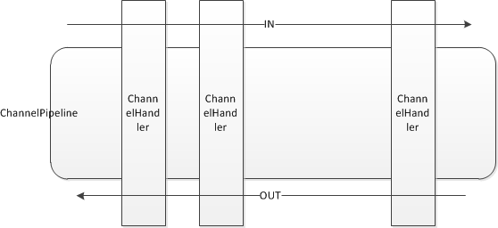

### bytebuf

缓冲区是不同的通道之间传递数据的中介，JDK中的ByteBuffer操作复杂，而且没有经过优化，所以在netty中实现了一个更加强大的缓冲区 ByteBuf 用于表示字节序列。ByteBuf在netty中是通过Channel传输数据的，新的设计解决了JDK中ByteBuffer中的一些问题。

netty中ByteBuf的缓冲区的优势： 
（1）可以自定义缓冲区的类型；

（2）通过内置的复合缓冲类型实现零拷贝；

（3）不需要调用flip()函数切换读/写模式

（4）读取和写入的索引分开了，不像JDK中使用一个索引

（5）引用计数（referenceCounting的实现原理？）

（6） Pooling池

#### 1.ByteBuf与ByteBuffer的对比：

先来说说ByteBuffer的缺点： 
（1）下面是NIO中ByteBuffer存储字节的字节数组的定义，我们可以知道ByteBuffer的字节数组是被定义成final的，也就是长度固定。一旦分配完成就不能扩容和收缩，灵活性低，而且当待存储的对象字节很大可能出现数组越界，用户使用起来稍不小心就可能出现异常。如果要避免越界，在存储之前就要只要需求字节大小，如果buffer的空间不够就创建一个更大的新的ByteBuffer，再将之前的Buffer中数据复制过去，这样的效率是奇低的。
    
final byte[] hb;// Non-null only for heap buffers
             
（2）ByteBuffer只用了一个position指针来标识位置，读写模式切换时需要调用flip()函数和rewind()函数，使用起来需要非常小心，不然很容易出错误。              

下面说说对应的ByteBuf的优点： 
（1）ByteBuf是吸取ByteBuffer的缺点之后重新设计，存储字节的数组是动态的，最大是Integer.MAX_VALUE。这里的动态性存在write操作中，write时得知buffer不够时，会自动扩容。            

（2） ByteBuf的读写索引分离，使用起来十分方便。此外ByteBuf还新增了很多方便实用的功能。    


#### 2.netty中的ByteBuf的类型：

JDK中的Buffer的类型 有heapBuffer和directBuffer两种类型，但是在netty中除了heap和direct类型外，还有composite Buffer(复合缓冲区类型)。

(1)Heap Buffer 堆缓冲区

这是最常用的类型，ByteBuf将数据存储在JVM的堆空间，通过将数据存储在数组中实现的。 
1）堆缓冲的优点是：由于数据存储在JVM的堆中可以快速创建和快速释放，并且提供了数组的直接快速访问的方法。

2）堆缓冲缺点是：每次读写数据都要先将数据拷贝到直接缓冲区再进行传递。
```
ByteBuf heapBuffer = Unpooled.buffer();  
System.out.println(heapBuffer);  
```

(2)Direct Buffer 直接缓冲区

Direct Buffer在堆之外直接分配内存，直接缓冲区不会占用堆的容量。

（1）Direct Buffer的优点是：在使用Socket传递数据时性能很好，由于数据直接在内存中，不存在从JVM拷贝数据到直接缓冲区的过程，性能好。

（2）缺点是：因为Direct Buffer是直接在内存中，所以分配内存空间和释放内存比堆缓冲区更复杂和慢。

虽然netty的Direct Buffer有这个缺点，但是netty通过内存池来解决这个问题。直接缓冲池不支持数组访问数据，但可以通过间接的方式访问数据数组：
``` java
ByteBuf directBuf = Unpooled.directBuffer(16);   
if(!directBuf.hasArray()){   
    int len = directBuf.readableBytes();   
    byte[] arr = new byte[len];   
    directBuf.getBytes(0, arr);   
}  
```
但是上面的操作太过复杂，所以在使用时，建议一般是用heap buffer。 

不过对于一些IO通信线程中读写缓冲时建议使用DirectByteBuffer，因为这涉及到大量的IO数据读写。对于后端的业务消息的编解码模块使用HeapByteBuffer。

(3)Composite Buffer 复合缓冲区

这个是netty特有的缓冲类型。复合缓冲区就类似于一个ByteBuf的组合视图，在这个视图里面我们可以创建不同的ByteBuf(可以是不同类型的)。 这样，复合缓冲区就类似于一个列表，我们可以动态的往里面添加和删除其中的ByteBuf，JDK里面的ByteBuffer就没有这样的功能。


### channel
#### 1.工作原理
一旦用户端连接成功，将新建一个channel同该用户端进行绑定               
channel从EventLoopGroup获得一个EventLoop，并注册到该EventLoop，channel生命周期内都和该EventLoop在一起（注册时获得selectionKey）         
channel同用户端进行网络连接、关闭和读写，生成相对应的event（改变selectinKey信息），触发eventloop调度线程进行执行     
如果是读事件，执行线程调度pipeline来处理用户业务逻辑                       

Channel包含注册、活跃、非活跃和非注册状态，在一般情况下是从注册->活跃->非活跃->非注册,但用户可以从eventloop取消和重注册channel，因此在此情况下活跃->非注册->注册


### channelpipeline channelHandler

ChannelPipeline和ChannelHandler用于channel事件的拦截和处理，Netty使用类似责任链的模式来设计ChannelPipeline和ChannelHandler

ChannelPipeline相当于ChannelHandler的容器，channel事件消息在ChannelPipeline中流动和传播，相应的事件能够被ChannelHandler拦截处理、传递、忽略或者终止，如下图所示：



ChannelHandlerContext

每个ChannelHandler 被添加到ChannelPipeline 后，都会创建一个ChannelHandlerContext 并与之创建的ChannelHandler 关联绑定。


### EventLoop/EventLoopGroup
关于 Reactor 的线程模型
首先我们来看一下 Reactor 的线程模型.
Reactor 的线程模型有三种:

单线程模型
多线程模型
主从多线程模型
此处不多讲，网上很多文章

NioEventLoopGroup 与 Reactor 线程模型的对应， 不同的设置 NioEventLoopGroup 的方式就对应了不同的 Reactor 的线程模型.
单线程模型
```
EventLoopGroup bossGroup = new NioEventLoopGroup(1);
ServerBootstrap b = new ServerBootstrap();
b.group(bossGroup)
 .channel(NioServerSocketChannel.class)
```

多线程模型
同理, 再来看一下下面的例子:
```
EventLoopGroup bossGroup = new NioEventLoopGroup(1);
EventLoopGroup workerGroup = new NioEventLoopGroup();
ServerBootstrap b = new ServerBootstrap();
b.group(bossGroup, workerGroup)
 .channel(NioServerSocketChannel.class)
 ...
 ```
bossGroup 中只有一个线程, 而 workerGroup 中的线程是 CPU 核心数乘以2, 因此对应的到 Reactor 线程模型中, 我们知道, 这样设置的 NioEventLoopGroup 其实就是 Reactor 多线程模型.


至于主从多线程模型，暂时还没有更好的资料。


### Future/ChannelFuture

所有的Channel操作都是异步的，Channel的返回ChannelFuture的一些操作并不阻塞，而是立即返回，在未来某个时刻我们能够获得状态来判断该操作的状态是完成还是进行还是取消。 
注意ChannelFuture对象是操作一执行就立即返回了。ChannelFuture中提供的方法就是让检查操作完成状况。